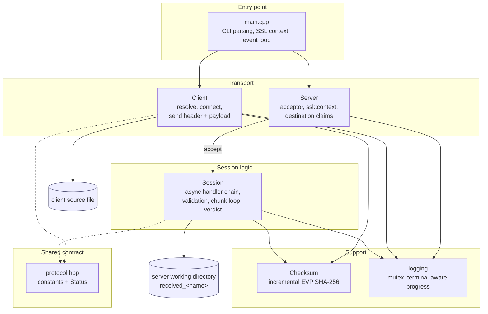

# System Architecture

**Project:** Secure Resumable File Transfer (SRFT)

This document describes the architecture of the implemented system: the layers,
the components and their responsibilities, the concurrency model, the data
structures, and the design decisions behind them. Diagrams are Mermaid, which
GitHub renders directly.

---

## 1. Architectural overview

The system is a single executable with two mutually exclusive modes, chosen by
the first command line argument. Both modes are built on Boost.Asio and OpenSSL,
but they have different lifetimes: the server is long-lived and multi-client,
the client is single-shot.

```
┌──────────────────────────────────────────────────────────────────┐
│                          CLIENT MACHINE                          │
│                                                                  │
│    local file system                                              │
│         │                                                        │
│         │ std::ifstream, read 64 KB at a time                    │
│         ▼                                                        │
│  ┌───────────────┐                                               │
│  │    Client     │  one file, then exit                          │
│  └───────┬───────┘                                               │
│          │                                                       │
│    Boost.Asio ssl::stream<tcp::socket>                           │
│    + EVP SHA-256                                                 │
└──────────┼───────────────────────────────────────────────────────┘
           │
           │  TCP + TLS 1.3                                        │
           │  control header, then payload in 64 KB chunks         │
           ▼
┌──────────────────────────────────────────────────────────────────┐
│                          SERVER MACHINE                          │
│                                                                  │
│  ┌───────────────┐   accept    ┌──────────────────────────────┐  │
│  │    Server     │────────────▶│  Session  (one per client)   │  │
│  │  acceptor     │             │  async handler chain         │  │
│  │  ssl::context │             │  validate → store → verify   │  │
│  │  name claims  │◀────────────│  claim / release destination │  │
│  └───────┬───────┘             └──────────────┬───────────────┘  │
│          │                                  │ std::ofstream       │
│          │                                  ▼                     │
│  ┌───────┴────────┐                  working directory            │
│  │ io_context on  │                  received_<name>             │
│  │ a thread pool  │                                               │
│  └────────────────┘                                               │
│                                                                  │
│    Boost.Asio ssl, logging (mutex), EVP SHA-256                  │
└──────────────────────────────────────────────────────────────────┘
```

## 2. Layers

| Layer | Contents | Responsibility |
| --- | --- | --- |
| Entry point | `main.cpp` | Parse and validate the command line, build the SSL context, run the event loop, translate the result into an exit code. Contains no protocol logic. |
| Transport | `server.cpp`, `client.cpp` | Accept and connect, own the TLS stream, drive the transfer. |
| Session logic | `serverSession.cpp` | The protocol state machine: request validation, chunk loop, integrity verdict, filename policy. |
| Support | `checksum.cpp`, `logging.hpp` | Incremental SHA-256, and thread-safe logging with terminal-aware progress. |
| Contract | `protocol.hpp` | Wire constants and the status codes. The only shared vocabulary between the two sides. |
| Build | `CMakeLists.txt` | Dependency discovery, TLS asset staging, MinGW runtime staging, CTest registration. |

The dependency rule is one-directional: `main` may use everything, a `Session`
may use `protocol`, `logging` and `Checksum`, and `protocol` and `logging` may
use nothing from the project. This keeps the wire format free of behaviour.

## 3. Component responsibilities

### 3.1 `Server` — `include/server.hpp`, `src/server.cpp`

Owns the TLS context, the acceptor, and the set of destination names currently
being written.

| Member | Purpose |
| --- | --- |
| `ctx` | `ssl::context`, created once and reused by every session, so the certificate is parsed a single time. |
| `acceptConnect` | The listening acceptor, bound to `tcp::v4()` on the chosen port. |
| `accept_connection()` | Asynchronously accept one connection and hand the socket to a new `Session`. |
| `claim_upload(name)` | Insert into `active_uploads_` under the mutex. Returns `false` if the name is already present, which is how *busy* is decided. |
| `release_upload(name)` | Remove the claim. Called on every exit path, success or failure. |
| `active_uploads()` | Current number of in-flight uploads. |
| `stop()` | Close the acceptor so `io_context::run()` can return. |

The class is non-copyable, because two servers sharing one acceptor would be a
bug rather than a feature.

### 3.2 `Session` — `include/serverSession.hpp`, `src/serverSession.cpp`

One instance per connected client, held alive by `enable_shared_from_this` so it
survives across asynchronous callbacks. The entire transfer is expressed as a
chain of completion handlers, and **at most one operation is ever outstanding**,
so the handlers of a single session can never run concurrently with each other.
That is what allows a fixed thread pool to serve many sessions safely without
per-session locking.

| Stage | Method | What happens |
| --- | --- | --- |
| Handshake | `start_session()` | TLS handshake as the server, then begin reading the request. |
| Header | `read_name_length` → `on_name_length` | Read the 4-byte name length. |
| Header | `on_filename` | Read the name bytes. |
| Header | `on_hash` | Read the 64-byte hex digest. |
| Header | `on_file_size` | Read the 8-byte size, then validate everything at once. |
| Decision | `on_file_size` | Validate the name, claim the destination, decide the resume offset, send `kProceed` or a refusal. |
| Payload | `read_chunk` / `on_chunk` | Loop: read up to 64 KB, append, repeat until the expected size is reached. |
| Verdict | `verify_and_finish` | Flush and close, hash the stored file, compare, delete on mismatch, send the final status. |
| Teardown | `abort` / `shutdown` | Release the claim, close the file and the socket. |

Validation deliberately happens entirely in `on_file_size`, after the whole
header has arrived. A refusal can therefore be reported as a status byte
instead of a misleading resume offset, and no payload byte is ever stored for a
request that will be rejected.

### 3.3 `Client` — `include/client.hpp`, `src/client.cpp`

Single-shot: resolve the host, connect with TLS, send the header, honour the
resume offset the server asks for, stream the remainder, then report the
server's verdict through `succeeded()`.

`set_server_name()` sets the SNI extension and must be called before the
connection is established, otherwise the server is asked for by IP rather than
by name and cannot select the right certificate.

### 3.4 `Checksum` — `include/checksum.hpp`, `src/checksum.cpp`

`calculate_sha256(path)` streams the file through OpenSSL's `EVP_Digest*` API in
fixed-size blocks, so hashing a 64 GiB file costs the same memory as hashing a
64 KB one. The `show_progress` flag enables a percentage line for long
operations.

### 3.5 `protocol` — `include/protocol.hpp`

The shared contract. It contains no logic precisely so that both sides cannot
disagree about it.

| Constant / type | Value | Meaning |
| --- | --- | --- |
| `kChunkSize` | 65536 | Payload bytes per write |
| `kHashHexLength` | 64 | SHA-256 rendered as lowercase hex |
| `kMaxNameLength` | 255 | Longest accepted file name |
| `kMaxFileSize` | 64 GiB | Largest accepted file |
| `Status::kProceed` / `kOk` | 0 | Request accepted / file verified |
| `Status::kChecksumMismatch` | 1 | Stored file did not match |
| `Status::kRejected` | 2 | Request refused before any payload |
| `Status::kBusy` | 3 | Another session holds this destination |
| `Status::kError` | 4 | Unspecified failure |

`kProceed` and `kOk` deliberately share the value 0: the same status set is used
twice, once to accept a request and once to report its outcome.

### 3.6 `logging` — `include/logging.hpp`

Header-only. A mutex serialises every write so concurrent sessions cannot
interleave halves of each other's lines. Progress is the awkward case: it is
rewritten in place and carries no newline, so it is erased before any other
output and padded to the widest text it has used so the field never shrinks.
Progress is emitted only when stdout is a terminal, so a redirected log
contains just real log lines.

## 4. Concurrency model

```
io_context
   │
   ├── worker thread 1 ─┐
   ├── worker thread 2  │  run() until no work remains
   └── worker thread 3 ─┘
         │
         ├── Session 1 handler   (only one operation in flight)
         ├── Session 2 handler   (only one operation in flight)
         └── Session 3 handler   (only one operation in flight)
```

- The pool is `min(4, hardware_concurrency)`, with a floor of 2, so that a
  single-session machine still has a spare thread.
- A handler runs on whichever worker picks up the completed operation. Because
  a session never has two operations in flight, its own handlers are
  serialised by construction, not by a lock.
- The only shared mutable state between sessions is `Server`'s claim set, which
  is guarded by `uploads_mutex_`, and the log, guarded by the logging mutex.
- The client runs a single thread: there is exactly one connection and no
  concurrency to exploit.

The trade-off is explicit. A synchronous blocking design would be simpler, but
one slow client would occupy a thread for the whole transfer; with N slow
clients the pool would be exhausted. The asynchronous design trades a longer
handler chain for the ability to serve many clients from a small, fixed set of
threads.

## 5. Data structures

| Structure | Type | Why this type |
| --- | --- | --- |
| Stored file | `std::ofstream out_` | Sequential append; no seeking is needed because resumption is expressed as the stored length. |
| Chunk buffer | `std::vector<char> chunk_` (64 KB) | Allocated once per session and reused for every chunk, so a transfer performs no per-chunk allocation. |
| Claim set | `std::unordered_set<std::string>` | Membership test is all that is needed; O(1) average lookup keeps the request path cheap. |
| Session registry | none | Sessions are owned by their completion handlers via `shared_from_this`; a separate registry would be redundant and a leak risk. |
| Session identifier | `static std::atomic<unsigned int>` | Monotonic, shared by all instances, and lock-free, so numbering sessions does not contend with the transfer path. |
| Resolver | `tcp::resolver resolver_` | Handles host names and IPv4/IPv6 literals uniformly, so `localhost` and `127.0.0.1` behave identically. |
| SSL context | `ssl::context` | One context per process, shared by reference, so the certificate and key are loaded once. |

## 6. Wire protocol

```
client                                   server
  |------- uint32 name_len -------------->|
  |------- name_len bytes filename ------>|
  |------- 64 bytes hex SHA-256 --------->|
  |------- uint64 file_size ------------->|
  |                                        |  validate the whole request
  |<------ uint8 status (proceed|refused) -|
  |<------ uint64 resume_offset ----------|  only when proceeding
  |------- payload in 64 KB chunks ------>|
  |<------ uint8 status (verified|failed)-|
```

All scalars are host byte order and each is written with a single
`boost::asio::write`, so no packing is required and a short write cannot split a
field.

**Why the resume offset is the stored file length.** It removes all protocol
state. The server has nothing to remember beyond the file on disk, so there is
no checkpoint file to corrupt, and a client that reconnects after a server
restart resumes correctly with no handshake of prior state.

**Why the request is validated before the payload.** It makes a refusal
unambiguous. If the server replied with a resume offset before knowing the
request was acceptable, a rejected client would read that offset as a genuine
instruction and corrupt the file.

## 7. Key design decisions

| Decision | Alternative rejected | Reason |
| --- | --- | --- |
| Asynchronous, one operation in flight | Thread per connection | A thread per client cannot scale, and a blocking session pins a worker for the whole transfer. |
| Resume offset = stored length | Explicit checkpoint file | No extra state to corrupt; survives a server restart for free. |
| Validate header, then refuse | Accept, then discover the problem | A refusal must not be mistakable for a resume instruction. |
| One writer per destination | Last writer wins, or unique names | Prevents two clients silently interleaving into one file. |
| `received_` prefix | Original name | Keeps uploads clear of existing files and makes partial files recognisable. |
| Host byte order, single writes | Packed wire structs | Removes struct padding as a source of corruption. |
| Incremental EVP hashing | Load the file into memory | Bounded memory for arbitrarily large files. |
| Terminal-only progress | Always draw the bar | A redirected log would be buried under hundreds of identical lines. |

## 8. Security design

| Control | Mechanism |
| --- | --- |
| Confidentiality and integrity in transit | TLS 1.2+ via `boost::asio::ssl` and OpenSSL |
| Server authentication | Certificate chain verification against a configured CA |
| Host binding | SNI, plus `X509_check_host` / `X509_check_ip_asc` on the leaf certificate |
| End-to-end integrity | SHA-256 of the stored file compared with the client's digest |
| Path traversal | Rejection of `/`, `\`, `.`, `..`, reserved device names, trailing space or dot |
| Resource limits | 255-byte name cap, 64 GiB file cap |
| Key hygiene | Certificate and key generated at setup, excluded from version control |

Two details in the host check are worth recording. The verify callback returns
`false` whenever `preverified` is already false, so a callback bug can never
upgrade a failed chain into an accepted one. And the name is only checked at
error depth 0, because only the leaf certificate identifies the server.

## 9. Deployment and environment

| Concern | Handling |
| --- | --- |
| TLS assets | Copied next to the executable at configure time; the program also looks in `tls_key/` |
| Asset lookup order | Next to the executable, then the working directory, so the build's own copy wins |
| MinGW runtime | `libstdc++`, `libgcc`, `libwinpthread`, `libatomic`, `libssp`, `libssl`, `libcrypto` are copied next to the executable, because a missing DLL otherwise aborts the launch with `0xC0000135` and no message |
| MSVC | Static CRT, so no runtime staging is needed |
| Shutdown | `SIGINT` / `SIGTERM` close the acceptor and stop the event loop cleanly |
| Exit codes | `0` only when the server confirmed a matching digest; `1` for any failure |

## 10. Component diagram



See [UML.md](UML.md) for the class, sequence and state machine diagrams.
