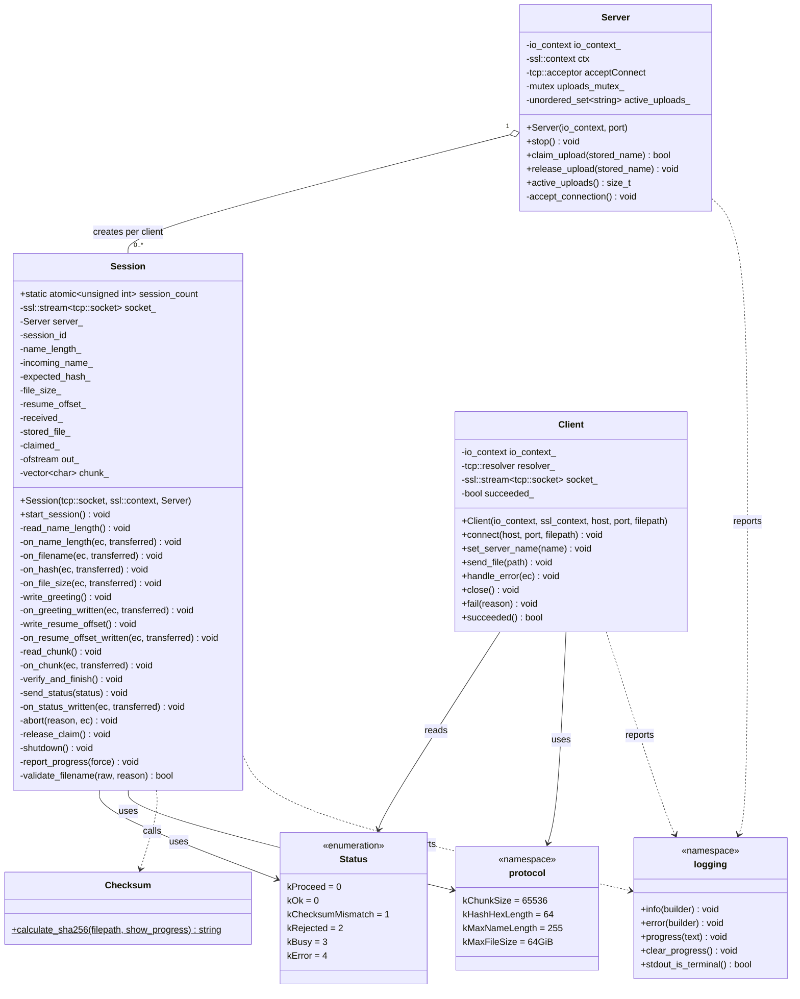
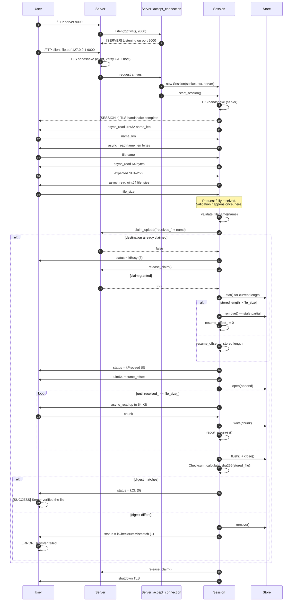
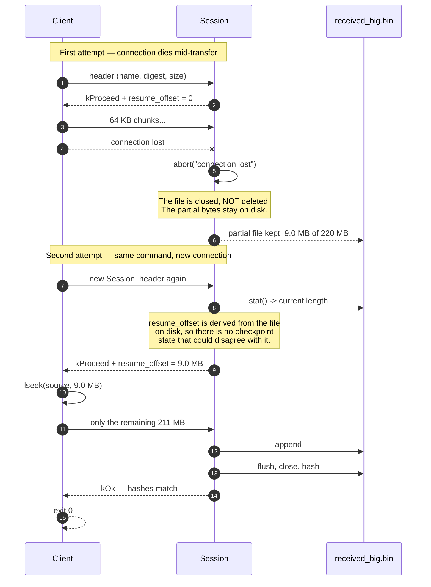
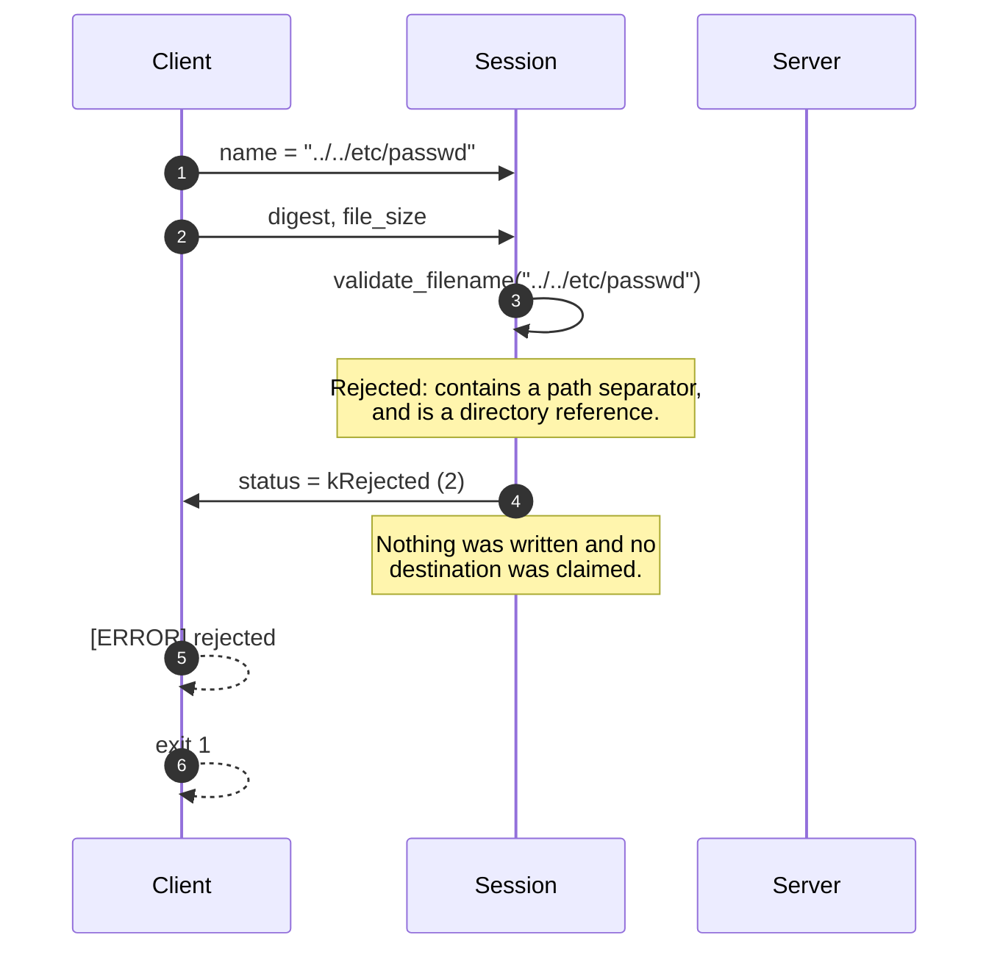
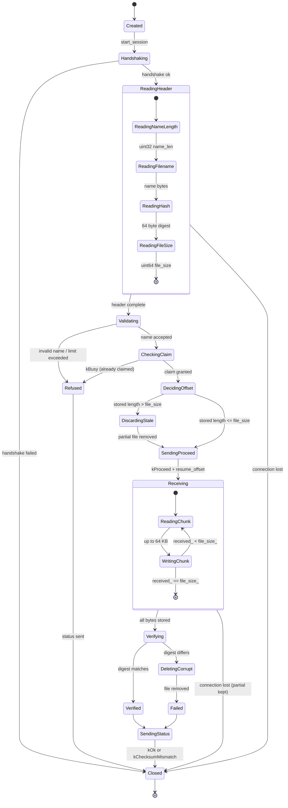
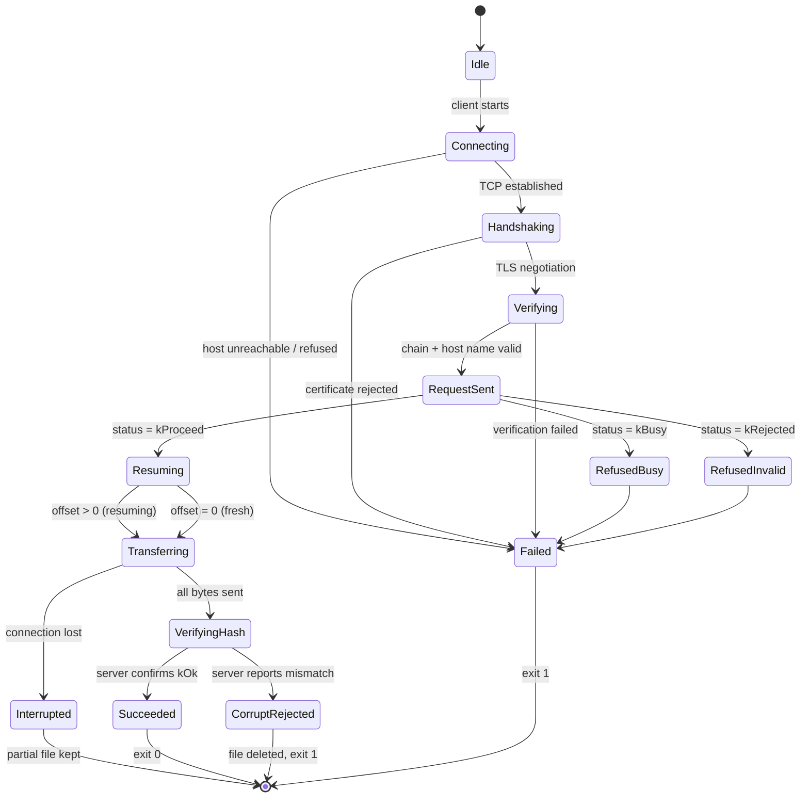

# UML Diagrams

Diagrams for the Secure Resumable File Transfer system, matching
[ARCHITECTURE.md](ARCHITECTURE.md) and the code in `include/` and `src/`.

Contents:

1. [Class diagram](#1-class-diagram)
2. [Sequence diagram — successful transfer](#2-sequence-diagram--successful-transfer)
3. [Sequence diagram — interrupted transfer and resume](#3-sequence-diagram--interrupted-transfer-and-resume)
4. [Sequence diagram — refused request](#4-sequence-diagram--refused-request)
5. [State machine — Session](#5-state-machine--session)
6. [State machine — transfer as a whole](#6-state-machine--transfer-as-a-whole)

---

## 1. Class diagram

`Server` creates sessions and is the only place that decides whether a
destination is free. A `Session` never talks to another `Session`; concurrent
sessions are kept apart by having one outstanding operation each.

---

## 2. Sequence diagram — successful transfer

## 3. Sequence diagram — interrupted transfer and resume

The client command is identical both times. Everything needed for resumption is
already on disk, so no session state has to survive the failure.

## 4. Sequence diagram — refused request

Refusal happens after the header is complete but before any payload, so a
rejected client can never be handed a resume offset it might act on.

---

## 5. State machine — `Session`

Two transitions matter most. `Receiving --> Closed` deliberately **keeps** the
partial file, because that file is the resumption state. `Verifying -->
DeletingCorrupt` removes a file that failed its hash, so a corrupt upload is
never left looking like a successful one.

## 6. State machine — transfer as a whole

`Interrupted` is a dead end for that run, but not for the transfer: rerunning
the identical command re-enters at `Resuming`, and the offset is recomputed from
the file on disk.
